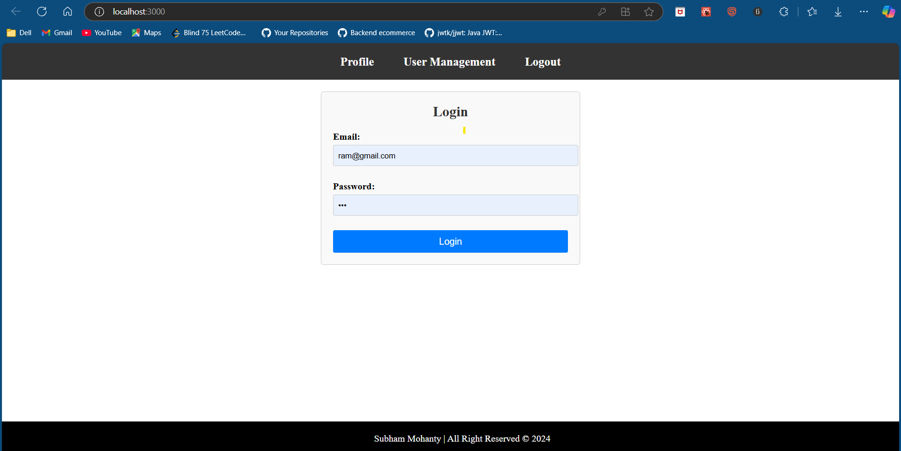
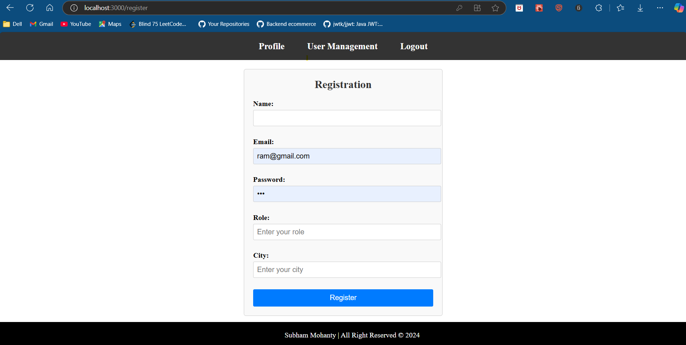
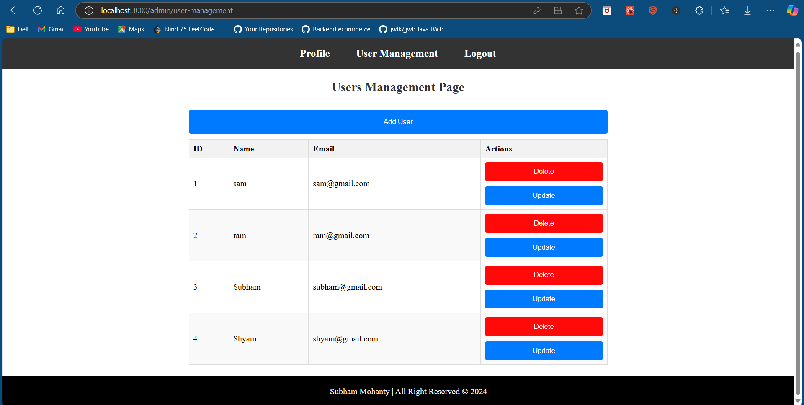

# User Management System


A user management system built with **Spring Boot** for the backend and **React.js** for the frontend. It includes features like user authentication, role management, and a user-friendly interface.

## Features
- User Registration and Login with JWT authentication
- Role-based access control (Admin and User roles)
- Profile and user management (Admin can view/update/delete users)

## Directory Structure
```
spring-boot + react/
├── backend/            # Spring Boot backend
├── frontend/           # React frontend
└── images/             # Screenshot images
```

## Screenshots




## Requirements
- **Java 17+**, **Maven**, **MySQL** (for backend)
- **Node.js**, **npm** (for frontend)

## Installation

### Backend
```bash
cd backend
# Configure MySQL in src/main/resources/application.properties
./mvnw clean install
./mvnw spring-boot:run
```
_Backend runs at [http://localhost:8080](http://localhost:8080)_

### Frontend
```bash
cd frontend
npm install
npm start
```
_Frontend runs at [http://localhost:3000](http://localhost:3000)_

## Technologies Used
- **Backend**: Spring Boot, Spring Security, MySQL
- **Frontend**: React.js, Tailwind CSS, Axios

## License
Licensed under the MIT License.
